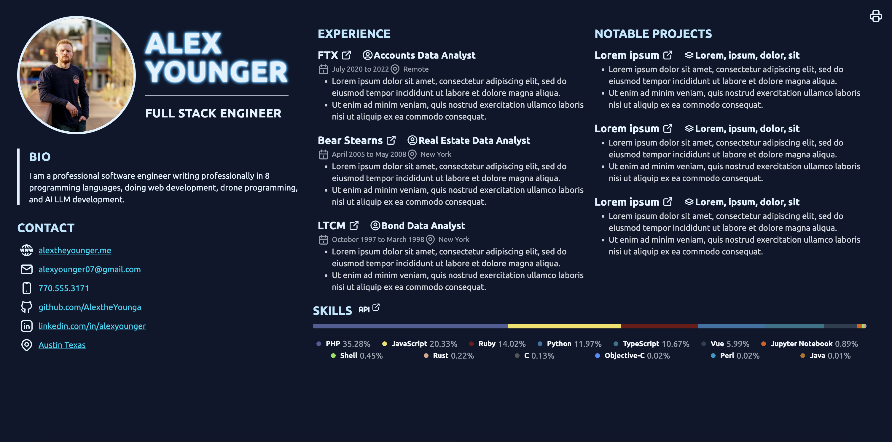
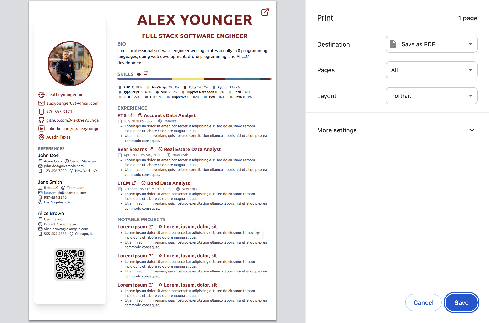

# Vue Resume Template for Web (Desktop & Mobile) and Print Versions

Look to [resume.js](./src/resume.js) for inputting information.

[Working Example](https://resume.alexyounger.me/)

## Web


## Print



## Recommended IDE Setup
This template should help get you started developing with Vue 3 in Vite.

[VSCode](https://code.visualstudio.com/) + [Volar](https://marketplace.visualstudio.com/items?itemName=Vue.volar) (and disable Vetur).

## Customize configuration

See [Vite Configuration Reference](https://vite.dev/config/).

## Project Setup

```sh
npm install
```

### Compile and Hot-Reload for Development

```sh
npm run dev
```

### Compile and Minify for Production

```sh
npm run build
```
